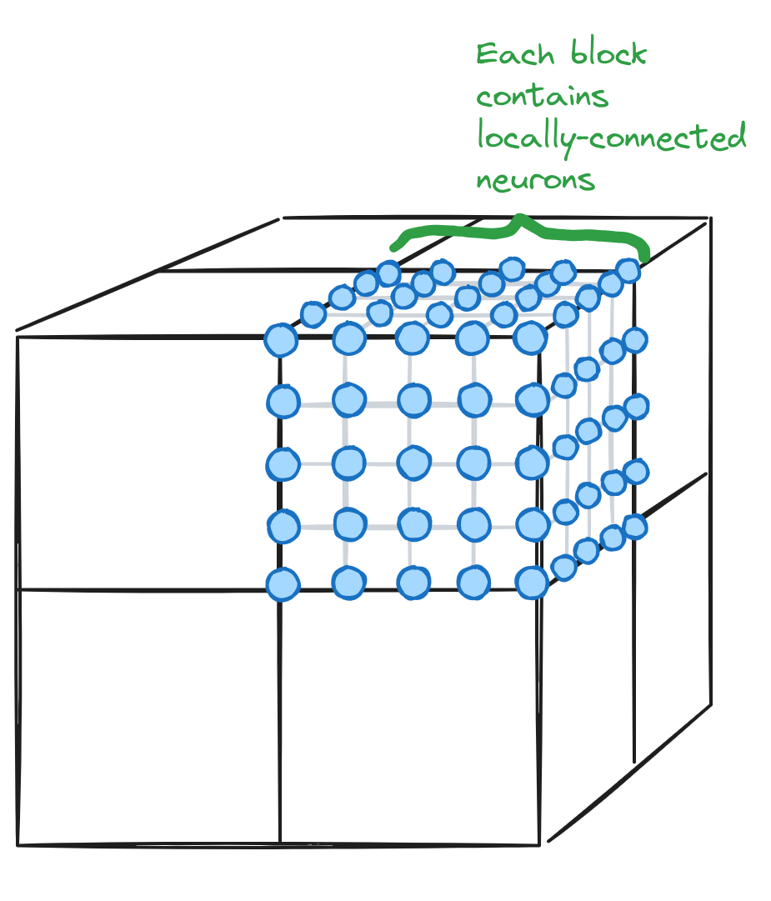

# gridnet

A recurrent neural network architecture with sparse, local weights.

# Architecture

A gridnet model consists of a 3D grid of activations. The grid is further subdivided into `NxNxN` **blocks**, where each block is typically pretty small (e.g. 8x8x8, to support efficient CUDA implementations with 512 threads per block).

In each step of the forward pass, each block is updated independently for one or more inner-loop iterations. In particular, each activation in a block is updated using a weighted sum of its neighbors 3^3 neighbors (including itself), followed by an activation function. Before each of these updates, the activations in the block are normalized (similar to layernorm) to prevent exploding activations. The blocks are updated with residual connections, to allow gradients to flow to earlier iterations despite the normalization.

Blocks only communicate across outer-loop iterations. In particular, the outer shell of each block takes inputs from the outer shells of the surrounding blocks (since neurons on the edge of a block are adjacent to neurons on the edge of other another block). This means that, the more outer-loop iterations are used, the more information is able to propagate throughout the network.

In my experiments, I feed inputs to one side of the grid, and extract outputs from the other side of the grid. This requires information to be able to flow from one end to the other.

