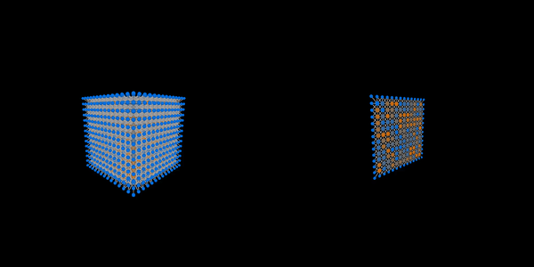
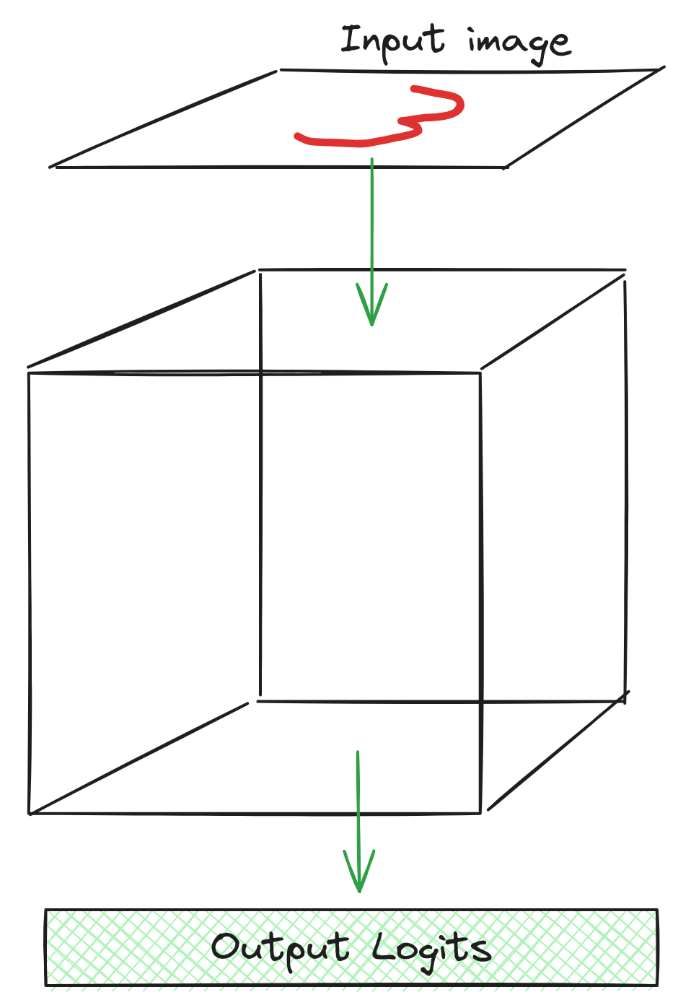

# gridnet

**gridnet** is a neural network architecture with sparse, locally-connected weights. As the name suggests, neurons in a gridnet are arranged in a 3-dimensional cube, and each neuron is only connected to its neighboring 3x3x3 grid. Inputs are embedded into one side of the cube, and information flows to the other side of the cube where output prediction scan be read out. For more details, see the [Architecture](#architecture) section.

This repository includes the following:

 * Scripts to train gridnet models on MNIST and ImageNet
 * A very suboptimal PyTorch reference implementation of the architecture
 * Optimized CUDA kernels to make training more practical
 * An in-browser demo with optimized WebGPU inference kernels
 * Some notebooks for gradient derivations
 * Code to produce a visualization of the architecture.

# Architecture

A gridnet model consists of a 3D grid of activations. The grid is further subdivided into `NxNxN` **blocks**, where each block is typically pretty small (e.g. 8x8x8 or 4x4x4 to support efficient CUDA implementations). Blocks can be updated locally multiple times without sharing information across blocks. In particular, the gridnet is repeatedly split up into blocks and then recombined. While split, each block takes one or more recurrent steps according to its weights, using a cached (stale) version of the neighboring activations from adjacent blocks. Each time the blocks are recombined, they update their cache of the adjacent blocks, and then a global normalization operation (like `LayerNorm`) is applied.

During the block-local update, each activation is updated using a weighted sum of its `3x3x3` neighborhood (including itself), followed by an activation function. Before each of these updates, the activations in the block may be normalized to prevent exploding activations, though I found this to be harmful in early experiments. The blocks are updated with residual connections to allow gradients to flow to earlier iterations more easily.

Blocks only communicate across outer-loop iterations. In particular, the outer shell of each block takes inputs from the outer shells of the surrounding blocks (since neurons on the edge of a block are adjacent to neurons on the edge of other another block). This means that, the more outer-loop iterations are used, the more information is able to propagate throughout the network.

In my experiments, I feed inputs to one side of the grid, and extract outputs from the other side of the grid. This requires information to be able to flow from one end to the other.

